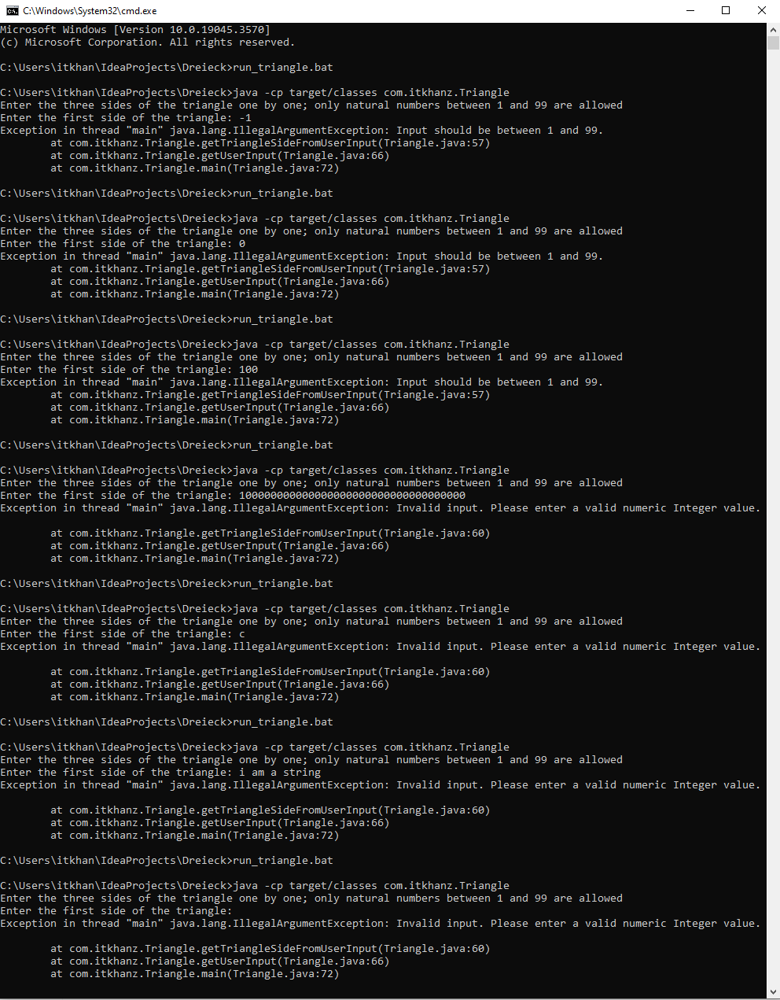

# Dreieck 3000

* Equilateral triangle: All sides are equal in length.
* Equilateral triangle: All sides are equal in length.
* Equilateral triangle: All sides are equal in length.
* [Types of Triangle](https://www.cuemath.com/geometry/types-of-triangle/)

* [Triangle Inequality Theorem](https://www.wikihow.com/Determine-if-Three-Side-Lengths-Are-a-Triangle)
  * This theorem simply states that the sum of two sides of a triangle must be greater than the third side.
  * If this is true for all three combinations, then you will have a valid triangle.

## Application
* This application accepts the three sides of a triangle as input from user, and validates if a triangle is formed.
* It returns and outputs the triangle type formed.
* It can handle the non-numeric, spaces, and inputs exceeding Integer range.
* It only allows the input between 1 and 99 (both inclusive) as valid input numbers.
* If user enters invalid number, it throws illegal argument exception with a descriptive error message.

* Below image demonstrates the application working


## Running application
```shell
mvn clean compile
java -cp target/classes com.itkhanz.Triangle
```

## Running Tests
```shell
mvn clean test
```

## Unit Tests

This application also has unit tests written using JUnit4 to test the important flows:

1. **Equilateral Triangle Test**: Provide three equal sides (e.g., 5, 5, 5) as input. The expected result is "Equilateral triangle."
2. **Isosceles Triangle Test**: Provide two equal sides (e.g., 3, 3, 4) as input. The expected result is "Isosceles triangle."
3. **Scalene Triangle Test**: Provide three different sides (e.g., 3, 4, 5) as input. The expected result is "Scalene triangle."
4. **Invalid Triangle Test**: Provide sides that cannot form a valid triangle (e.g., 1, 2, 3). The expected result is "Not a triangle."
5. **Minimum Value Test**: Provide the minimum possible values (1, 1, 1) as input.  The expected result is "Equilateral triangle."
6. **Maximum Value Test**: Provide the maximum possible values (99, 99, 99) as input. The expected result is "Equilateral triangle."
7. **Edge Case Test**: Test the edge case where one side has the minimum value (1), and the other two sides have maximum values (99). The expected result is "Scalene triangle."
8. **Large Difference Test**: Test a case where the difference between sides is large but still forms a valid triangle (e.g., 10, 30, 40). The expected result is "Scalene triangle."

Moreover, some unit test cases are also added for user input validation for following cases:
* Negative Number
* Zero
* Number outside the valid range
* Non-Numeric Inputs (character, Strings, space)
* Number exceeding Integer limit

* Here are the test results:


* Below image demonstrates the input validation


